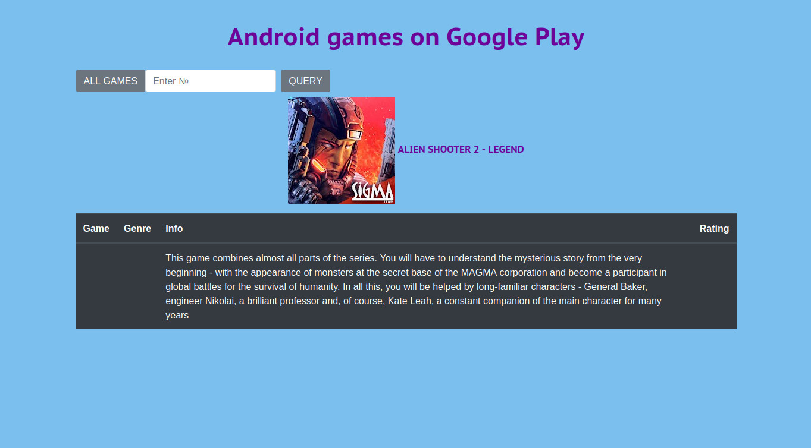
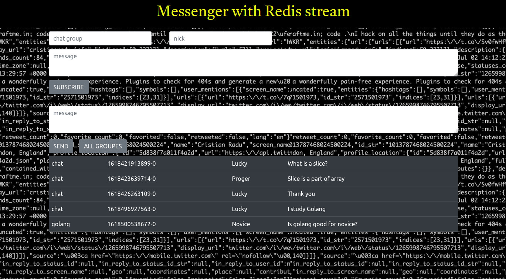
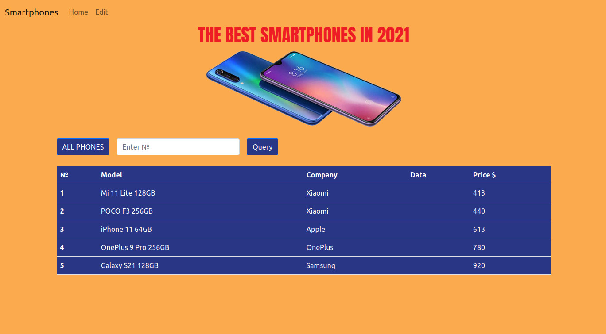

#### My programs in Go
I’m currently available for hire. How to reach me: ignatenkos@mail.ru   

<b>casndrus:</b> Clients persomal data. API using Cassandra and gorilla/mux.

<b>clikhousqlx:</b> Diff for kids. Click counter using ClickHouse with Adobe Animate CC animation.

<b>dokconc:</b> Age limit for subscribers. Concurrency in Go with MySQL in Docker.

<b>echov4:</b> Top graphic tablets for artists. Clicks analitics with Echo using Redis.

<b>firebase:</b> Сhat messenger. REST API with Firebase Firestore.

<b>freshbnt:</b> Digital wallet. Fresh Deno with BuntDB and TailwindCSS.

<b>graphql:</b> SSD M.2 storage devices. Graphql API using PostgreSQL.

<b>graphqlgo:</b> ASUS professional laptops. Graphql with graphic API.

<b>grpcblog:</b> Blog about Combat Skills. Blog using gRPC MongoDB and Gin.

<b>immudb:</b> Payment system. Transactions with immudb.

<b>influxstor:</b> The best fitness bracelets. Online shop with InfluxDB using chi.

<b>influxtran:</b> Wallet transactions in blockchain. Transactions with InfluxDB and Telegraf.

<b>jaegermysql:</b> Forward geocoding with Mysql and Jaeger. Jaeger in docker & Mysql.

<b>jwtgin:</b> Recent books about Golang. Authorization with JWT Gin pgx/4 SQLite GORM.

<b>jwtmux:</b> The best SCI-FI audiobooks, movies, books. Authorization with JWT gorilla/mux GORM SQLite3.

<b>kafkaredis:</b> Voting for a best action movie. Kafka data stream using Redis.

<b>kubmysql:</b> Phones for games. REST API with MySQL and sql in Kubernetes.

<b>kubserv:</b> New Cars in Russia. Go web app with Ingress in Kubernetes.

<b>mongo:</b> Freelance programmers. Website using MongoDB & gRPC.

<b>mongodb:</b> Online store purchase analytics. REST API with MongoDB and css animation.

<b>oauth2crdl:</b> Articles about OAuth2 on Golang. Authorization using OAuth2 & Javascript.

<b>oauth2gugl:</b> Places of interest in Italy. Places of interest in Italy.

<b>oauth2srv:</b> Useful sources on OAuth2 and JWT in Golang. Authorization with OAuth2 & SQLite3.

<b>parse:</b> Top rated albums. Website with html page parsing.

<b>posts:</b> Posts about Golang. Graphql with PostgreSQL.

<b>prometmetric:</b> Sending metrics from app to Prometheus. Metrics in Prometheus and Grafana.

<b>protobuf:</b> New cars in Russia. gRPC with MySQL and output of Base64-encoded images to HTML.

<b>raftbolt:</b> Distributed system. Raft with boltdb.

<b>reaktnxtm:</b> Payment system. Next js with typescript Material UI Envoy and Aerospike.

<b>redis:</b> Android games on Google Play. Website using Redis.

<b>rediscach:</b> Chat with Redis and Firebase. REST API with Redis cache and Firebase.

<b>redispool:</b> Apple iPhone with Redis. Website using Redis connection pool.

<b>redistream:</b> Messenger with Redis stream. REST API with Redis stream.

<b>request:</b> Go resources for dev tools. REST API with PostgreSQL sqlx and pq.

<b>stream:</b> Interview task to design a service. Data stream to a browser with websocket & gohook.

<b>sqlite3:</b> The Best Smartphones. REST API with Sqlite3.

<b>swag:</b> List of the books about Golang. Swagger API using swag PostgreSQL chi pgxpool.

<b>transactn:</b> Crypto wallet UI. Token transactions with GORM, Postgres & JWT authorization.

<b>validauth:</b> User login to the site. Authentication with ozzo-validation, gorilla/sessions, google/uuid.

<b>websockchat:</b> Websocket Chat. Realtime Chat App with Websocket and ReactJS.

